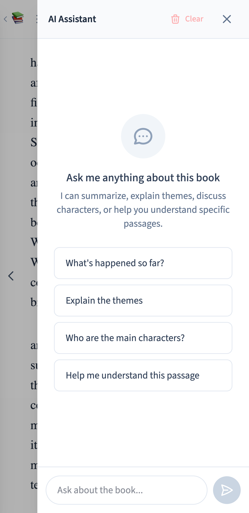
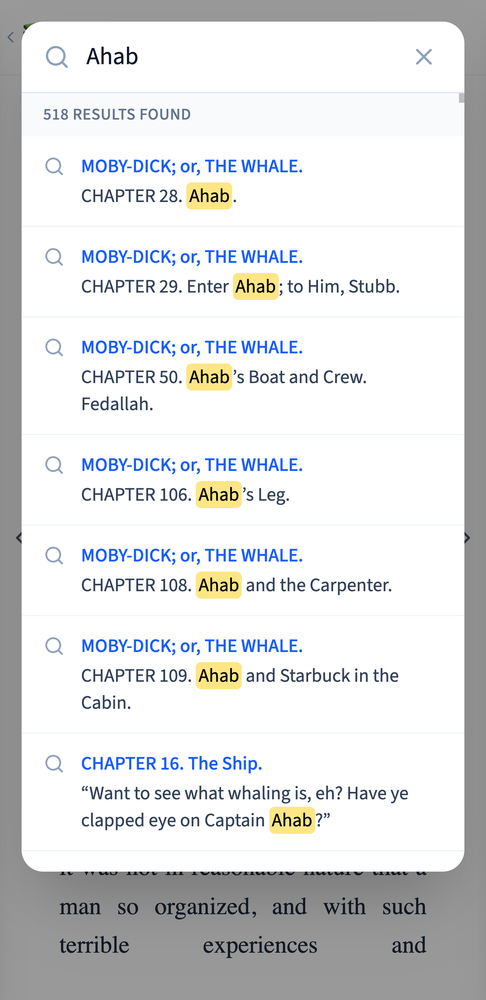
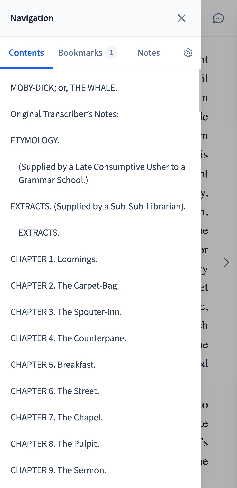
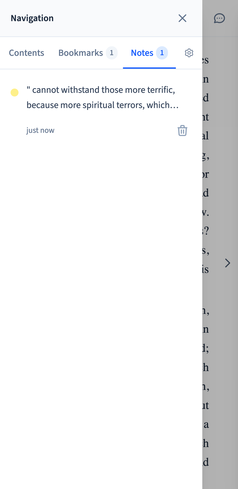
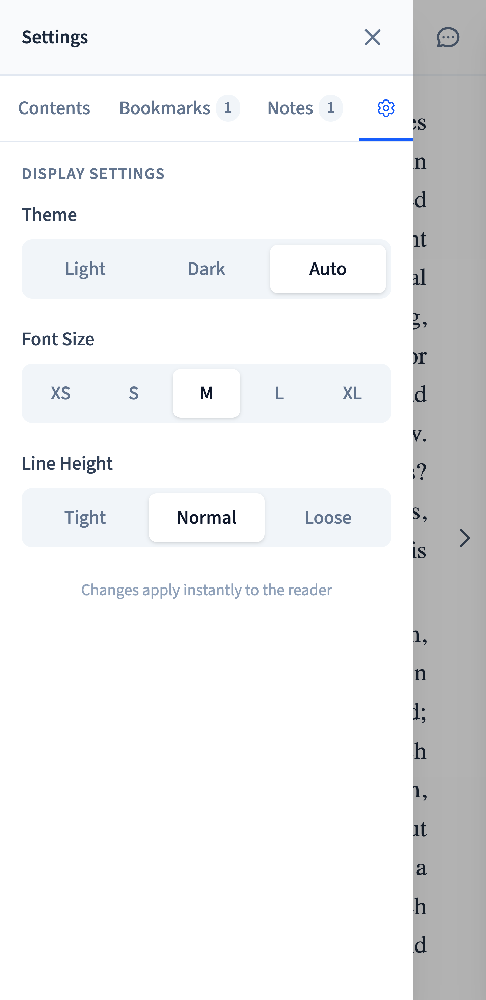

# 📖 Quick Reader

A modern, offline-first EPUB reader with embedded AI assistant.

<p align="center">
    
  
  
</p>

<p align="center">
    
  
  
</p>

## Features

- **Offline-first**: All books and data stored locally in IndexedDB
- **AI Assistant**: Chat about your books using any OpenAI-compatible API
- **Highlights & Notes**: Color-coded annotations with notes
- **Bookmarks**: Save and navigate to important passages
- **Full-text Search**: Find text across your book
- **Customizable**: Theme, font size, spacing, and line height settings
- **PWA**: Install as a standalone app

## Setup

1. Install dependencies:
   ```bash
   npm install
   ```

2. Configure AI (optional):
   Create a `.env` file with your AI settings:
   ```env
   AI_API_KEY=GEMINI_API_KEY
   AI_BASE_URL=https://generativelanguage.googleapis.com/v1beta/openai/
   AI_MODEL=gemini-2.5-pro
   ```

3. Start the dev server:
   ```bash
   npm run dev
   ```

## AI Configuration

The AI assistant uses [Vercel AI SDK](https://sdk.vercel.ai) to connect to any OpenAI-compatible API.

If no API key is configured, the AI assistant will show a configuration message.
